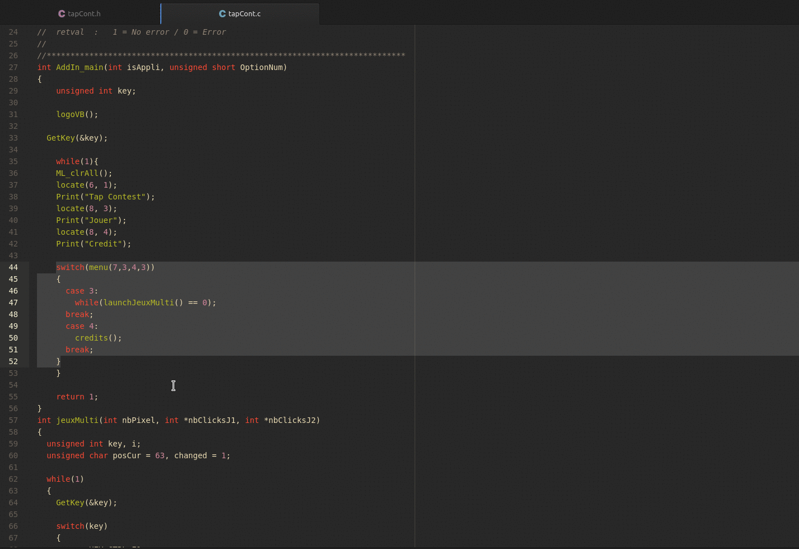

# Quick Comment Package

A package for Atom to quickly add comments



## Install

With the atom command:
```bash
apm install quick-comment
```
Or  atom package manager: Settings ➔ Packages ➔ Search for `quick-comment`

## Usage

- Activate with <kbd>Alt</kbd>-<kbd>Shift</kbd>-<kbd>c</kbd> or through the command panel with `Quick Comment:Toggle Comment`.

- The package can also add brackets with <kbd>Alt</kbd>-<kbd>Shift</kbd>-<kbd>[</kbd> or with the command `Quick Comment:Add Brackets`
